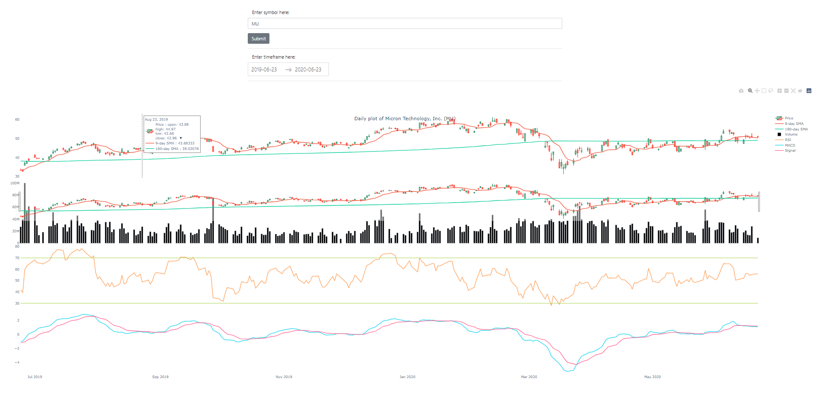

# General Purpose stock tracker (tickers from Yahoo Finance)

This is my second iteration of a stocks tracker. If you would like to see my first implementation in Python Dash and Quandl, you can find it <a href="https://github.com/mi-mran/basic_stock_tracker" target="_blank">here</a>. This dashboard was initially created in April 2020, and has been worked on till May 2020.

:shipit:

Newer features include:
- Single tracking of tickers (compared to multi-tracking in previous iteration)
- OHLC indicators (compared to close only)
- 9-day SMA line
- 180-day SMA line
- Volume indicator
- RSI strength indicator
- MACD indicator

The libraries used are as follows:
- [Dash](https://dash.plotly.com/)
- [Datetime](https://docs.python.org/3/library/datetime.html)
- [Datetuil](https://dateutil.readthedocs.io/en/stable/)
- [Numpy](https://numpy.org/) 
- [Pandas](https://pandas.pydata.org/)
- [Plotly](https://plotly.com/python/)
- [Yfinance](https://github.com/ranaroussi/yfinance)

I created this dashboard as I felt that my previous dashboard was lacking in features. In addition, there was no longevity, since the ticker options in that dashboard was limited to a single static CSV file, which will eventually be outdated. Hence I used the yfinance module, which ensures that tickers are up-to-date as long as the module remains alive. I also included useful indicators which I felt could help in making decisions on a stock, or conducting basic technical analysis on the selected stock.

However, there are still some limitations, since the data retrieval ultimately relies on another module. Yfinance is unable to provide certain resolutions of historical data, hence I was unable to obtain the appropriate intra-day data and I have fixed the resolution to 1 day. In addition, the aesthetics of the dashboard can be improved for better readability. Such an improvement could include visibly separating the charts, or hiding certain charts, so as to allow better human-level comparisons.

If you are unfamiliar with Yahoo Finance and the structure of their ticker symbols, you can simply type the appropriate equity's name into the search bar on their <a href="https://finance.yahoo.com/">homepage</a>.

## Overview

The flow of the script is as follows:

1. Dashboard is loaded once the server is initialised. There is a default ticker which populates the charts.
2. The user can enter a valid ticker (valid on Yahoo Finance) and the appropriate timeframe. Once the parameters are set, the user will hit the 'Submit' button.
3. The dashboard is updated with the appropriate ticker's historical data. The user can slide along the rangefinder (below the first price graph) to zoom in or out on the timeframes. The user can also hover the respective graphs for more details.

If you are interested in my calculations of the various graphs, you can check the dash_charts.py file and navigate to the update_graph function in the app.layout (line 160 onwards).

---

This repo consists of 1 Python file and 2 folders.

- assets folder -> contains the favicon icon for the dashboard
- screenshots folder -> image of default dashboard interface
- dash_charts.py -> calls on yfinance and contains the structure of the dashboard and the calculations for the various lines (eg. SMA)

---

The image below shows the default dashboard interface when the server is initialised.

